# Petbnb

Petbnb is a digital platform designed to connect pet owners with reliable and trustworthy pet sitters.

## Description / User Story

As a dog owner, it is crucial to find a reliable pet sitter to ensure that I can leave my pet in capable hands when I'm away. There are various criteria that I consider when searching for a sitter, including the sitter's experience with dogs, their knowledge of pet care, and their availability to meet my specific scheduling needs. Hence, an app that can showcase detailed information about the sitter is important to facilitate an informed decision.

As a pet sitter, it is essential to manage my services efficiently. Based on personal experience, one of the top pet sitting providers that I currently use does not offer the most seamless method. An ideal application should facilitate the process of finding, booking, and managing pet sitting services, allowing pet sitters to dedicate more time to caring for the pets rather than managing bookings.

## Getting Started - Planning

#### Project Time Frame

2 weeks

### WireFrame in [Figma](https://www.figma.com/board/JIRoTkITPhgx8Zyveg98G1/Project-3?node-id=0-1&t=hBoZp2vjF42wfAoh-1)

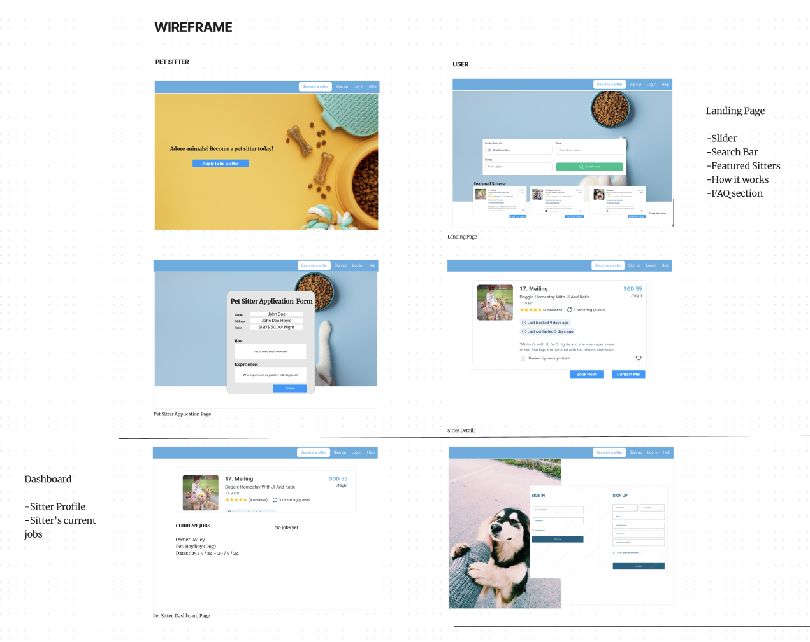

### Example Schema in [Google Sheets](https://docs.google.com/spreadsheets/d/1wz7Gcyl5nVbwnUO6_fICRzO2d5oNztfd3A_VLjPeUFU/edit?usp=sharing)

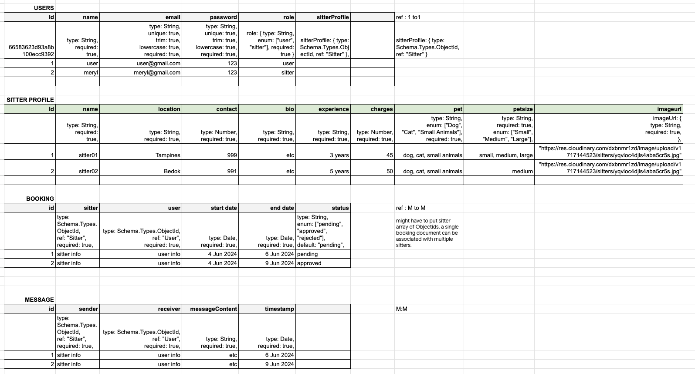

### Deployed on Render

Try it here: (https://petbnb-g8ax.onrender.com)

---

### Landing Page

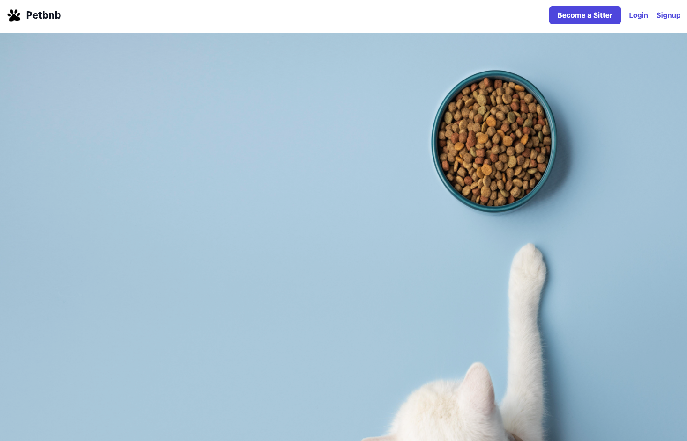
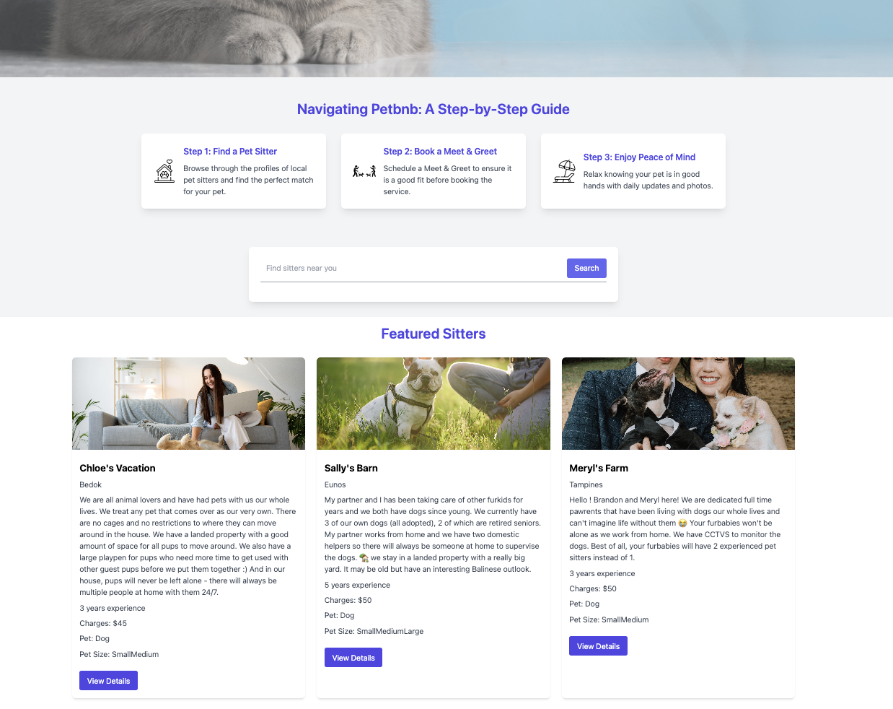

### Be A Sitter

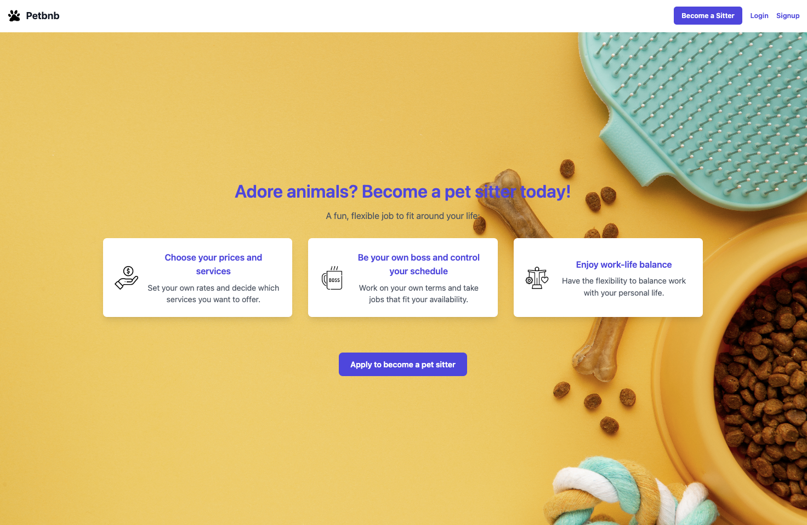

### Sitter Details

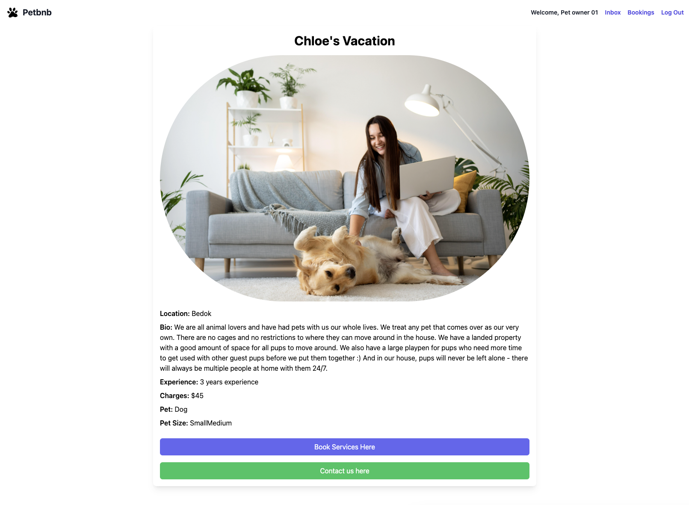

### My Calendar

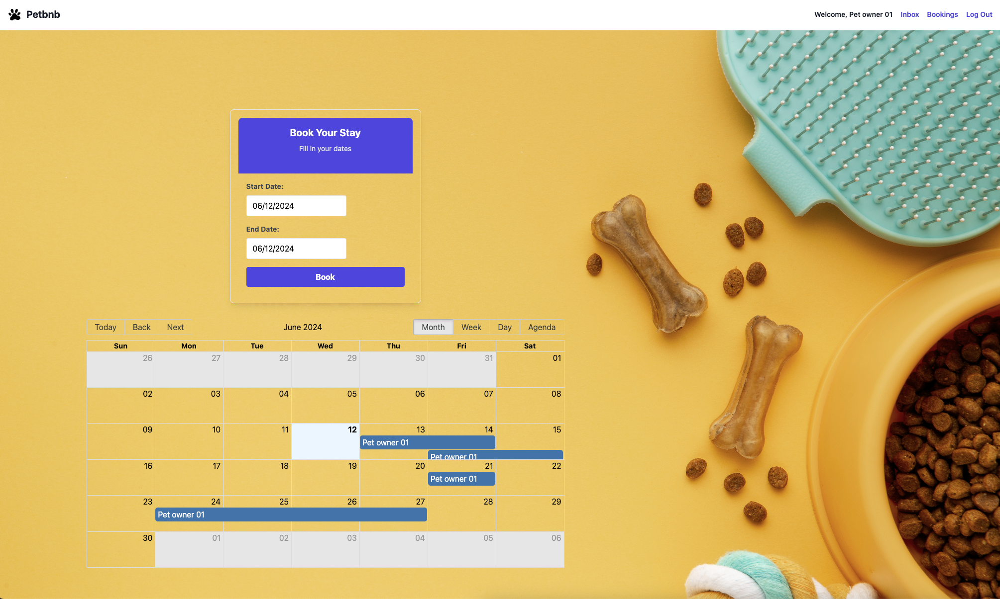

### Booking Page

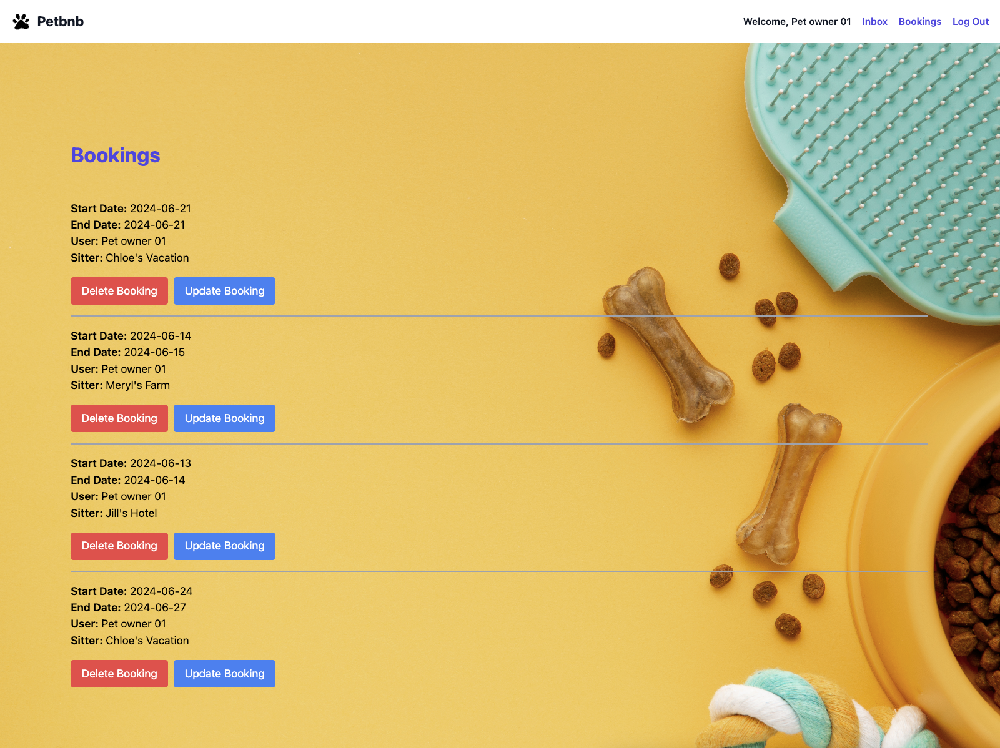

### Sitter Profile

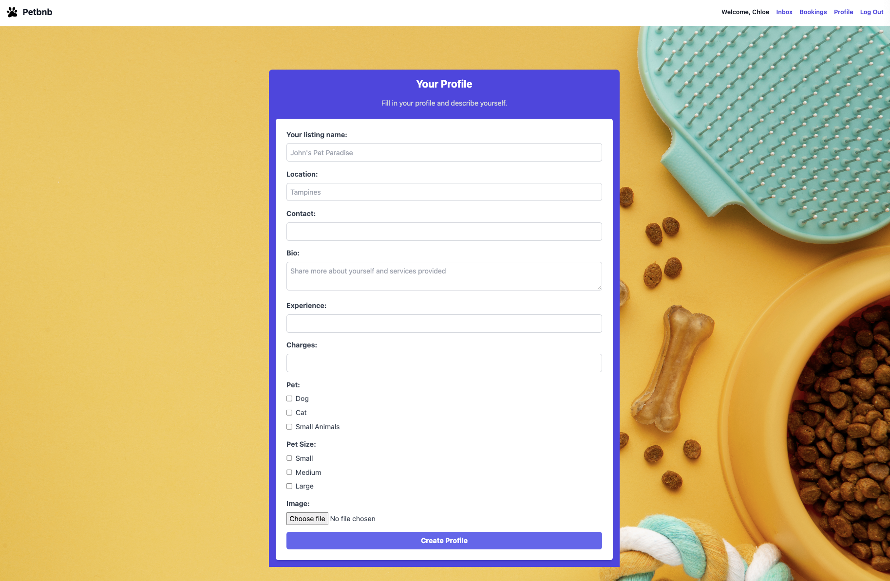

### Inbox

## 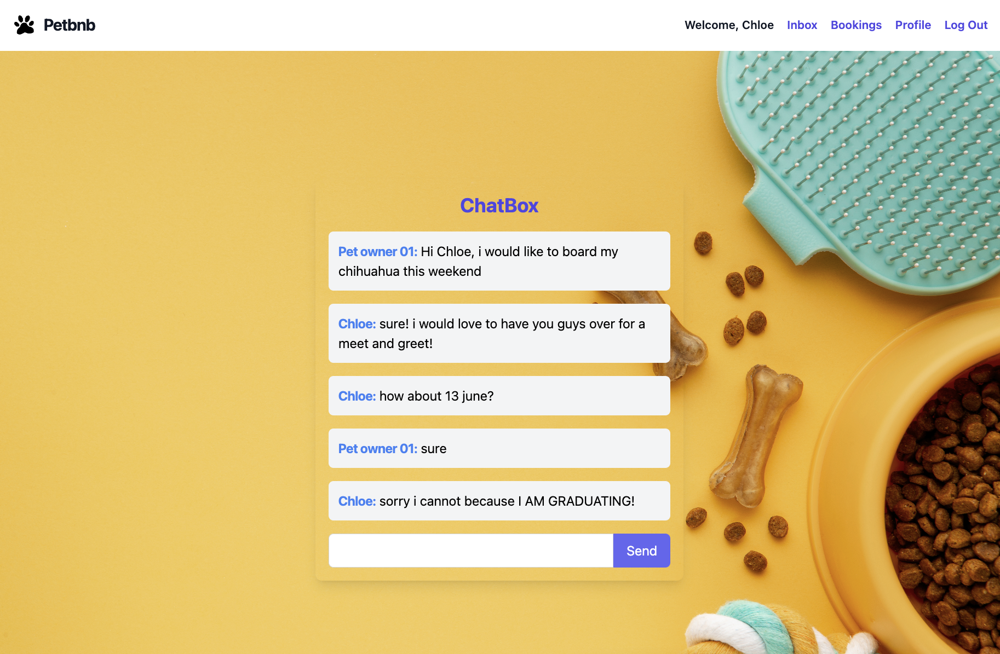

### Favourite

Backend: Set up Multer(store temporily) and Cloudinary(after receiving upload to cloud) for handling image uploads. Adjust the controller to handle the uploaded file and save its URL in the database(MongoDb).
Frontend: Update the form to handle file input and send the form data as multipart/form-data.

This setup ensures that the server handles the file upload process, which can be beneficial for validation, security, and further processing.

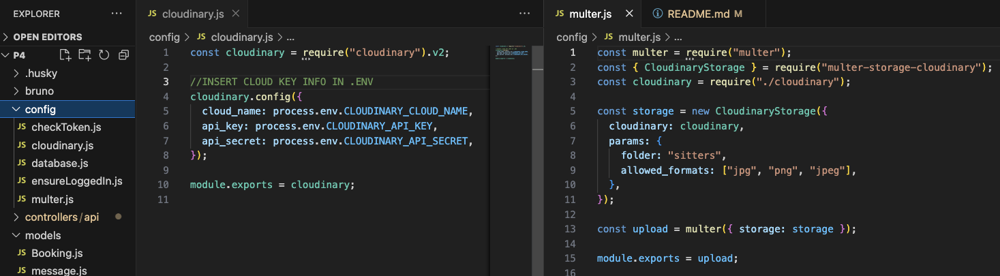
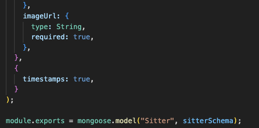
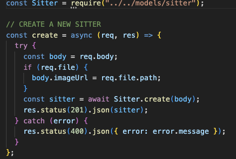
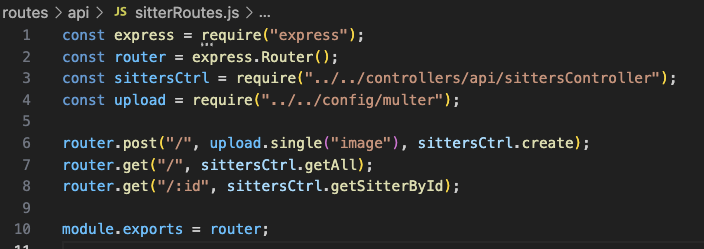
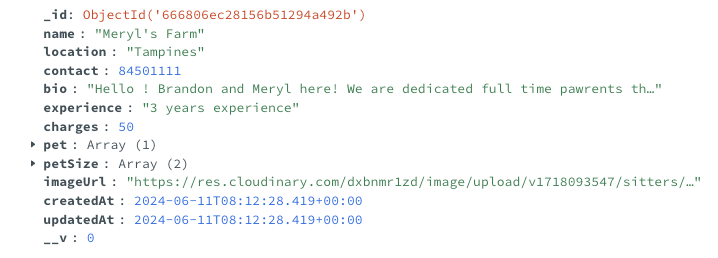
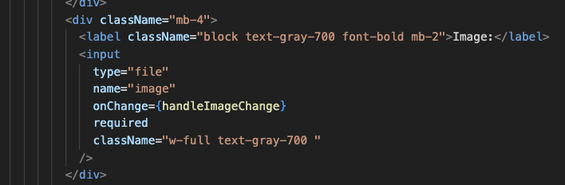

### Least Favourite

Uncaught DOMException: Failed to execute 'atob' on 'Window': The string to be decoded is not correctly encoded., suggests that the string you're trying to decode using atob() is not properly encoded.

atob is a JavaScript function that decodes a string of data that has been encoded using Base64 encoding(for images or files).

How did i solve:
clear local storage cache in application.

## CRUD

### Update:

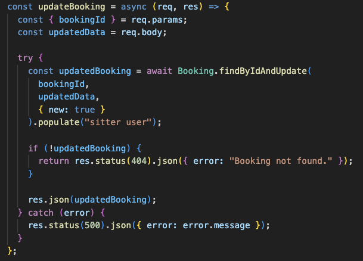

### Delete:

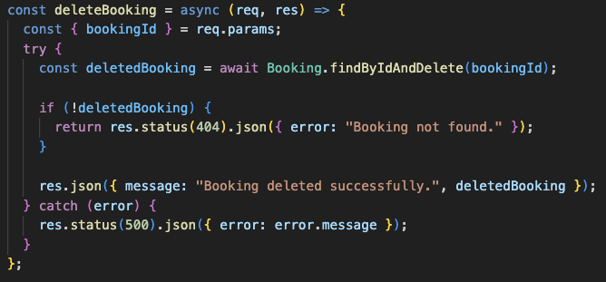

### Overlap + Max Capacity of 2 pets

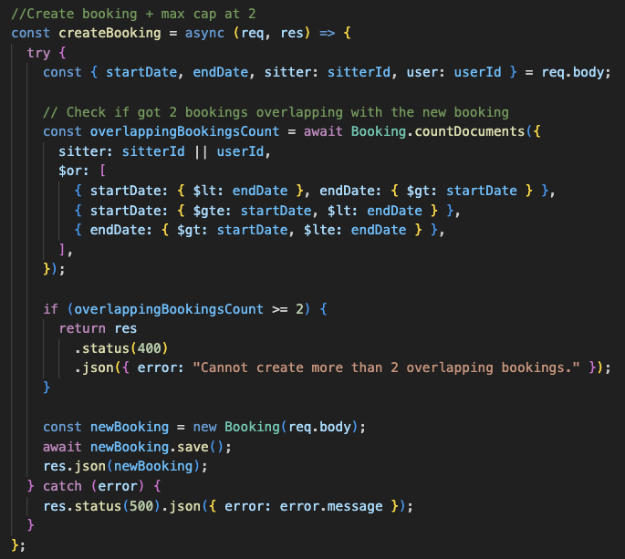

### Navigate the user ans sitter on App Page

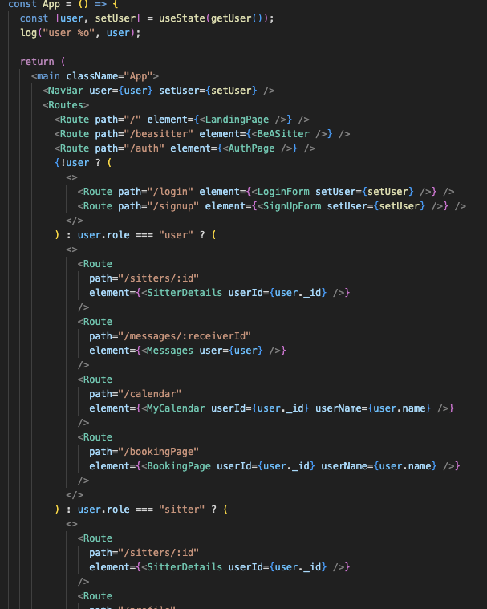

### Key Takeaways

- The planning phase at the start is important because I realize that as I code more, it becomes hard to change once everything is established.
- Knowing that my code is not perfect and that making mistakes is part of the journey, I should take it easy because I will have to make mistakes to learn my lessons.

### Icebox

- Include **map** to direct to nearby location.

- Include other **services** such as daycare, pet transportation.

- Loyalty program, perks and points system.

- Include a **third** user: admin.

- Add sign up **verification** that only allows all users to sign up if conditions are fufilled and approved by admin.

### Tech Stack

##### Programming Language

- **Javascript** - For both frontend and backend

##### Frontend

- **Vite** - Fast development build tool
- **React** - JavaScript library for building user interfaces
- **Tailwind CSS** - Utility-first CSS framework for styling
- **React Big Calendar** - Calendar library for React

##### Backend

- **Node.js** - JavaScript runtime environment
- **Express** - Web application framework for Node.js

##### Database

- **MongoDB** - NoSQL database
- **Mongoose** - MongoDB object modeling tool

##### Authentication & Security

- **JSON Web Token (JWT)** - For creating and verifying tokens
- **jwt-decode** - Library to decode JWT tokens
- **bcrypt** - Password hashing library

##### Deployment

- **Render** - Cloud platform for deploying web applications

##### Development & Testing Tools

- **MongoDB Compass** - GUI tool for MongoDB
- **Bruno** - API testing tool (for backend validation)
- **VS Code** - Code editor
- **Figma** - Wireframe tool (for UI/UX design)

- Multer
  -Cloudinary
  -React Big Calendar
  -Datepicker

## Reference

https://www.flaticon.com/
https://www.freepik.com/
